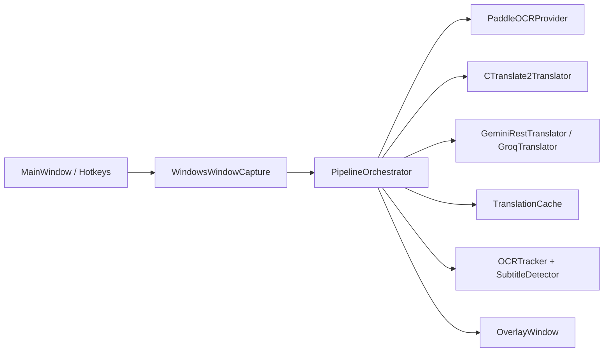

# Kiến Trúc Hệ Thống

## Mục tiêu của app

`AutoTrans` là ứng dụng OCR overlay cho game trên Windows với 2 luồng chính:

- `Realtime OCR`: bắt subtitle/ngắn, dịch nhanh, ưu tiên độ trễ thấp
- `Deep Mode`: quét toàn màn hình, gom đoạn văn theo layout, ưu tiên ngữ cảnh tốt hơn

## Thành phần chính

### 1. Bootstrap và wiring

File chính:
- `src/autotrans/app.py`

Vai trò:
- tạo `QApplication`
- nạp `AppConfig`
- mở `SettingsDialog`
- chuẩn bị runtime directories và runtime logging
- khởi tạo các service chính
- bọc OCR và local translator bằng lazy wrapper để không chặn startup

Các factory quan trọng:
- `_build_realtime_ocr_provider()`
- `_build_deep_ocr_provider()`
- `_build_local_translator()`
- `_build_cloud_translator()`

## 2. UI layer

File chính:
- `src/autotrans/ui/main_window.py`
- `src/autotrans/ui/overlay.py`
- `src/autotrans/ui/settings_dialog.py`
- `src/autotrans/ui/global_hotkeys.py`

Vai trò:
- chọn cửa sổ game
- start/stop pipeline realtime
- bật/tắt overlay
- kích hoạt deep mode
- render overlay dịch
- hiển thị trạng thái và thống kê pipeline

## 3. Capture layer

File chính:
- `src/autotrans/services/capture.py`

Vai trò:
- liệt kê các cửa sổ đang mở
- chụp ảnh cửa sổ game
- chọn backend capture theo config

Backend hiện có:
- `printwindow`
- `bettercam`
- `mss`

Thứ tự fallback phụ thuộc vào `capture_backend`, nhưng đều cố ưu tiên lấy frame hợp lệ trước khi trả về `Frame`.

## 4. OCR layer

File chính:
- `src/autotrans/services/ocr.py`

Vai trò:
- OCR realtime theo dòng
- OCR deep mode theo đoạn văn
- merge line boxes
- map line OCR vào layout regions

Stack hiện tại:
- chỉ dùng `PaddleOCRProvider`
- detector: `PP-OCRv5_mobile_det`
- recognition ưu tiên: `en_PP-OCRv5_mobile_rec`
- layout deep mode: `PP-DocLayout-S`

## 5. Pipeline orchestration

File chính:
- `src/autotrans/services/orchestrator.py`

Vai trò:
- điều phối end-to-end capture -> OCR -> select/group -> translate -> overlay
- tách rõ realtime path và deepmode path
- quản lý cache
- quản lý tracking, stabilization, overlay reconciliation
- chọn translator phù hợp

## 6. Translation layer

File chính:
- `src/autotrans/services/translation.py`

Translator hiện có:
- local: `CTranslate2Translator`
- cloud: `GeminiRestTranslator`, `GroqTranslator`

Chính sách:
- realtime chỉ dùng local `ctranslate2`
- deep mode ưu tiên cloud provider đã chọn, nếu không dùng được thì fallback `ctranslate2`

## 7. Shared data model

File chính:
- `src/autotrans/models.py`

Các model cốt lõi:
- `Rect`
- `Frame`
- `OCRBox`
- `TranslationRequest`
- `TranslationResult`
- `OverlayItem`
- `PipelineStats`

## Sơ đồ tổng quan

## Nguyên tắc thiết kế hiện tại

- Một OCR stack duy nhất: `PaddleOCR`
- Tách biệt realtime và deep mode ở tầng orchestrator, không trộn mục tiêu tối ưu
- Lazy init cho các thành phần nặng
- Cache translation theo text/source/target/glossary version
- Overlay là lớp hiển thị, không chứa business logic OCR/translation
