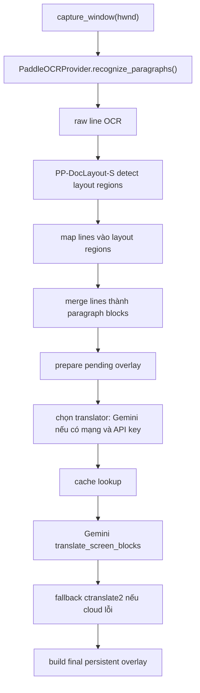

# Flow Deep Mode

## Mục tiêu

Deep mode dùng để quét toàn màn hình game, gom các line OCR thành block có ngữ cảnh tốt hơn, rồi dịch theo block.

Luồng này ưu tiên:
- ngữ cảnh
- chất lượng dịch đoạn văn
- giữ layout block đủ tốt để overlay lại

Không tối ưu bằng realtime về độ trễ.

## Entry point

Từ UI:
- phím `Insert`
- hoặc nút `Deep Translate`

`MainWindow.toggle_deep_translation()` sẽ:
- chuyển trạng thái deepmode sang active
- hiện overlay trạng thái chờ
- spawn worker để chạy prepare phase

## Flow chi tiết

## Pha 1: Prepare

`PipelineOrchestrator.prepare_deep_translation()`

### Bước xử lý

1. `capture_window(hwnd)`
2. `deep_ocr_provider.recognize_paragraphs(frame)`
3. `_dedupe_boxes()`
4. `_select_deep_boxes()`
5. `build_pending_deep_overlay()`

### Kết quả

Trả về:
- `grouped_boxes`
- `pending overlay items`

Pending overlay hiển thị text:
- `Đang dịch...`

## Pha 2: OCR paragraph

`PaddleOCRProvider.recognize_paragraphs()`

### Các bước nội bộ

1. `_run_engine()`
   - OCR raw lines
2. `_merge_line_boxes()`
   - merge thành line rõ ràng hơn
3. `_detect_layout_regions()`
   - layout detection bằng `PP-DocLayout-S`
4. `_merge_layout_regions(..., line_separator="\\n")`
   - map line vào layout regions
   - merge line trong cùng region thành block paragraph

### Label layout hiện dùng

Hiện code chỉ ưu tiên merge theo các vùng:
- `text`
- `title`

Nếu không map được vào layout region:
- block vẫn có thể được merge theo heuristic paragraph thường

## Pha 3: Chọn translator

`PipelineOrchestrator._select_deep_translator()`

Logic:
- nếu có `cloud_translator`
- và `_network_available()` resolve được host Gemini
- dùng cloud
- nếu không thì dùng local `ctranslate2`

## Pha 4: Dịch block

`translate_deep_boxes()`

### Cache

Deep mode dùng cache riêng theo glossary version:
- `"{glossary_version}:deep:{translator_name}"`

Điều này giúp không lẫn cache giữa:
- realtime
- deep mode
- translator local/cloud khác nhau

### Fallback

Nếu cloud translator ném exception:
- log `deep cloud fallback triggered`
- tự động chuyển sang local `ctranslate2`

## Pha 5: Render kết quả

Kết quả cuối được render bằng persistent overlay:
- `visibility_state=VISIBLE`
- `region="deep-ui"`
- `linger_seconds=0.0`

`MainWindow` giữ overlay này cho tới khi:
- người dùng ẩn deep mode
- chạy deep mode mới
- hoặc xảy ra lỗi/timeout

## Timeout và lỗi

`MainWindow` có watchdog:
- kiểm tra theo `deep_translation_timeout_ms`
- nếu quá hạn: hủy deepmode hiện tại và hiện thông báo lỗi

Các lỗi thường gặp:
- không có API key
- mạng không dùng được
- Gemini rate limit / quota
- model Paddle chưa có cache và môi trường không thể tải model

## Điểm maintain cần nhớ

- Deep mode không được phép kéo chậm luồng realtime
- OCR deepmode dùng cùng `PaddleOCRProvider` nhưng gọi method riêng `recognize_paragraphs()`
- Nếu chỉnh prompt Gemini, nên test lại bằng `render_deepmode_runtime_preview.py`
- Nếu đổi model layout hoặc heuristic merge, cần render lại PNG/JSON preview để so sánh trực quan

