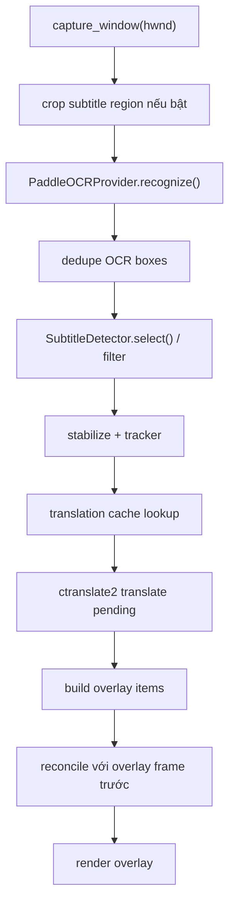

# Flow Realtime

## Mục tiêu

Luồng realtime dùng cho subtitle hoặc text ngắn cần độ trễ thấp.

## Entry point

UI gọi:
- `MainWindow.toggle_pipeline()`
- timer gọi tiếp `MainWindow._tick_pipeline()`
- worker thread chạy `PipelineOrchestrator.process_window()`

## Flow chi tiết

## Các bước quan trọng

### 1. Capture

`WindowsWindowCapture.capture_window()` trả về `Frame`.

Thông tin đi kèm:
- `image`
- `timestamp`
- `window_rect`
- `metadata.capture_backend`

### 2. Crop subtitle

Trong `PipelineOrchestrator._crop_ocr_frame()`:
- chỉ crop khi `subtitle_mode=true`
- và `ocr_crop_subtitle_only=true`

Đây là tối ưu hiệu năng quan trọng nhất của realtime OCR.

### 3. OCR realtime

`PaddleOCRProvider.recognize()`:
- resize theo `ocr_max_side`
- gọi PaddleOCR engine
- normalize output
- filter box không meaningful
- merge box cùng dòng bằng `_merge_line_boxes()`

### 4. Chọn box để dịch

`_select_boxes()`:
- nếu `subtitle_mode=true`: dùng `SubtitleDetector`
- nếu không: giữ rộng hơn nhưng vẫn lọc noise
- luôn bỏ box quá ngắn hoặc rác

### 5. Ổn định kết quả

Realtime có 2 lớp ổn định:

- `_stabilize_boxes()`
  - chỉ cho box đi tiếp sau số scan ổn định tối thiểu
- `_track_boxes()`
  - dùng `OCRTracker` để giữ continuity giữa các frame

### 6. Dịch

Realtime chỉ dùng local translator:
- `CTranslate2Translator`

Lý do:
- độ trễ thấp
- tránh phụ thuộc mạng
- hành vi ổn định hơn cho subtitle ngắn

### 7. Cache

`TranslationCache` được dùng trước khi gọi translator.

Cache key logic gồm:
- source text
- source lang
- target lang
- `glossary_version`

MainWindow còn gắn cache DB riêng theo game/window:
- `capture_service.get_cache_db_path(hwnd)`

### 8. Overlay

`_translate_and_build_overlay()` tạo `OverlayItem`.

Sau đó:
- `_group_overlay_items()` có thể gom nhiều line thành đoạn hiển thị
- `_reconcile_overlay_items()` làm mượt vị trí overlay giữa các frame
- `_should_skip_similar_subtitle()` tránh lặp subtitle gần như giống hệt frame trước

## Metrics runtime

`PipelineStats` cập nhật:
- `capture_fps`
- `ocr_fps`
- `translation_latency_ms`
- `box_count`
- `cache_hits`

## Điểm maintain cần nhớ

- Realtime không dùng Gemini
- Bất kỳ thay đổi nào làm tăng số box OCR hoặc làm yếu subtitle crop thường ảnh hưởng mạnh tới latency
- Nếu tuning hiệu năng realtime, kiểm tra lại benchmark 11 ảnh subtitle sau mỗi thay đổi

